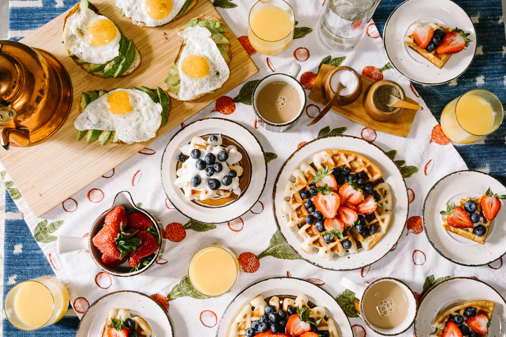

# SABOR & MAÑANA



Aplicación web responsive para un restaurante de desayunos, brunch y almuerzos en Lima. Incluye catálogo filtrable, favoritos, detalle de platos, carrito lateral, testimonios, reserva de mesa y continuación del pedido por WhatsApp.

## Ejecutar en local

Requiere Node.js 22.13 o superior.

```bash
npm install
npm run dev
```

La aplicación queda disponible en `http://localhost:3000/`.

## Comandos

```bash
npm run dev
npm run build
npm run lint
npm test
```

## Estructura principal

- `app/components/`: componentes reutilizables de interfaz e interacción.
- `app/data/menu.ts`: platos, categorías, precios, imágenes e ingredientes.
- `app/data/testimonials.ts`: testimonios simulados.
- `app/types/index.ts`: tipos de producto, carrito, reserva y testimonio.
- `app/globals.css`: tokens de color, tipografía, layout y estilos responsive.
- `public/`: fotografías gastronómicas locales y tarjeta social.

## Alcance de esta versión

Los datos son simulados en TypeScript. El carrito vive en memoria, la reserva muestra una confirmación local y el pedido abre WhatsApp. Persistencia, pagos, disponibilidad real de mesas y administración del menú requerirán backend en una siguiente etapa.

## Enfoque de portafolio

Este repositorio prioriza experiencia visual, responsive design, estructura de componentes y flujo de compra/reserva simulado. Es una buena pieza para mostrar maquetación moderna con React y datos tipados.
